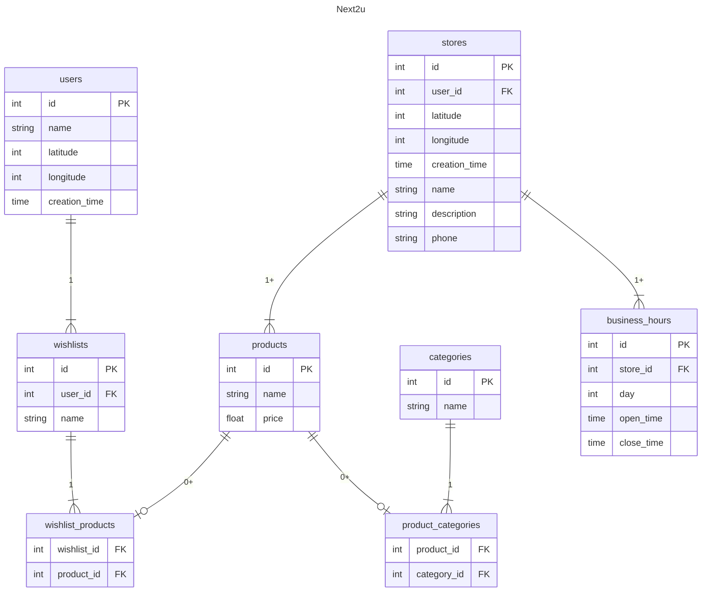

# Next2u API
* [Overview](#1-overview)
* [Definitions](#2-definitions)
* [Requirements](#3-requirements)
* [Data Structure](#4-data-structure)
* [Software](#5-software)
* [Roadmap](#6-roadmap)

## 1. Overview
Next2u API is the programming interface of the [Next2u application](https://github.com/JoHoodSu/next2u-app).
## 2. Definitions
## 3. Requirements
## 4. Data Structure

## 5. Software
## 6. Roadmap
> Current Iteration
https://github.com/orgs/JoHoodSu/projects/1/views/2  

> Planning
https://github.com/orgs/JoHoodSu/projects/1/views/4
